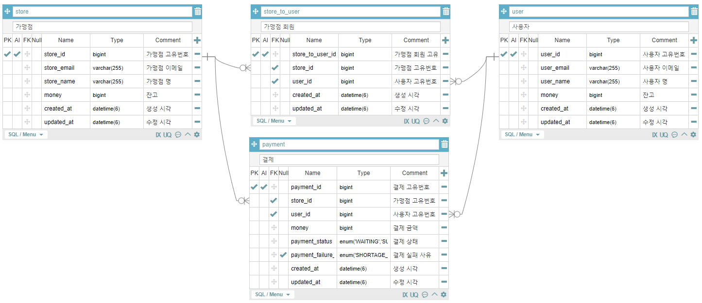

# 패스트캠퍼스 일할맛 2기 - 패캠페이

# [프로젝트 정보]

## 1. 기술 스택

   ```
   Java 17
   Spring Boot 3.2.0
   Gradle 7.6.1

   MySQL
   Spring Data JPA
   QueryDsl

   JUnit5
   RestDocs
   ```

## 2. API 문서

[패캠페이 API 문서](https://psh10066.github.io/devtaste-facampay/)

## 3. 실행 및 테스트 시 참고 사항

1. DB는 로컬 환경의 MySQL로 연결됩니다. 따라서 PC에 MySQL을 설치하고 root 계정의 비밀번호를 12345678로 설정하거나 `application.yml`에서 실행 환경에 맞게 수정한 이후, `facampay`라는 DB를 생성한 이후 실행해야 합니다.<br>
   (테스트 코드 실행 시 test 폴더의 `application.yml`을 참고해야 하고, `facampay-test`라는 DB를 생성해야 합니다.)
2. 가맹점 및 사용자 정보, 가맹점에 등록된 회원 정보는 실행 시 `data.sql` 을 통해 자동으로 insert됩니다. 따라서 따로 데이터를 추가하거나 할 필요 없이 아래의 유저 시나리오대로 테스트를 수행할 수 있습니다.

---

# [요구사항]

## 1. 백엔드 부분만 구현하더라도, 전체적으로 API가 클라이언트와 어떻게 통신하는지 흐름을 그려주세요.

### 유저 시나리오

1. 사용자가 가맹점에 회원으로 가입하고 로그인한다. (로그인되어있다고 가정)
2. 가맹점이 **회원 목록 조회 API**를 통해 본인 매장의 회원 목록을 확인한다.
3. 가맹점이 목록에서 회원을 선택하여 새로운 페이지에서 **회원 결제 정보 조회 API**를 통해 회원 정보 및 결제 이력을 확인한다.
4. 대기중인 결제 요청이 없는 경우 가맹점이 해당 페이지에서 **결제 요청 API**를 통해 회원에 대해 금액을 입력하고 결제 요청을 보낸다.
5. 사용자가 **결제 목록 조회 API**를 통해 결제 정보를 확인한다.
6. 사용자가 대기 건에 대해 **결제 시도 API**를 통해 결제를 시도한다.
    - 결제가 성공한 경우 해당 비용만큼 가맹점의 잔고가 올라가고, 사용자의 잔고에서 차감된다.
    - 결제가 실패한 경우 가맹점에서 결제 요청부터 다시 진행한다.
7. 가맹점이 잘못 결제를 요청한 경우 **결제 취소 API**를 통해 결제를 취소한다.

### 구현 상세 설명

1. `ddl-auto` create 설정 `data.sql` init을 통한 개발을 진행하고, 쿼리 및 트랜잭션 등의 로깅이 포함되어 있으므로 **배포 시에는 main의 application.yml 설정을 아래와
   같이 변경**한다.
    1. `spring.sql.init.mode` : none
    2. `spring.jpa.hibernate.ddl.auto` : validate
    3. `logging.level`
        1. `root` : warn
        2. 타 항목 전체 삭제
2. API 통신을 위한 Http Status Code와 에러 코드 정의는 아래 카카오 REST API를 참고하여 구현하였고, 해당 정의는
   첨부한 [API 문서](https://psh10066.github.io/devtaste-facampay/)에서 확인할 수 있다.
    - [Kakao Developers](https://developers.kakao.com/docs/latest/ko/rest-api/reference#response-status-code)
3. “사용자의 인증은 이미 되어있다고 가정하고 사용자의 ID로 대체합니다.” 라는 요구사항에 맞춰 **Spring Security를 이용한 보안 관련 설정은 적용하지 않았고, API의 Request에 아래와 같은 값이 필수**로 들어간다. 추후 Spring Security가 적용되면 해당 필드들은 사라질 예정.
    1. 가맹점이 사용하는 API : 가맹점 고유번호 (storeId)
    2. 사용자가 사용하는 API : 사용자 고유번호 (userId)

---

## 2. 설계/구현 시에 발생할 수 있는 문제에 대해서 미리 정의하고 이를 어떻게 설계/구현 시에 해결했는지 문서로 정리합니다.

1. 가맹점이 아무 사용자한테 결제 요청을 보낼 수 있으면 안된다.
    - **등록된 회원에 한해 결제 요청**을 보낼 수 있도록 설계하고, 테스트 코드로 검증한다.

2. 한 사용자에게 동일한 결제 요청을 여러 번 보낼 수 있으면 안된다.
    - 가맹점과 사용자 간에는 **하나의 결제 대기 건만 존재**할 수 있도록 설계하고, 테스트 코드로 검증한다.

3. 가맹점이 실수로 결제를 요청하는 경우가 있을 수 있다.
    - 가맹점이 대기중인 결제에 한해 취소할 수 있도록 **결제 취소 API**를 구현하고, 테스트 코드로 검증한다.

4. 가맹점에 가입한 사용자가 많아지면 사용자를 식별하거나 찾기 어려울 수 있다.
    - 이메일을 가입한 아이디라고 가정하고 Unique Key로 세팅하여 **이름, 이메일 정보를 통해 회원을 식별**할 수 있다.
    - **이름, 이메일 검색 기능**을 통해 회원을 찾을 수 있다.

5. 결제 요청이나, 결제 시도, 결제 취소 로직이 동시에 진행되어서는 안된다.
    - Application의 Scale-Out을 고려하여 Application 내에서 동시성 처리를 진행하는 것이 아닌, 결제를 요청하거나 시도할 때의 조회 쿼리에 **DB의 비관적 쓰기 락**을 수행하고, 해당 row의 수정 로직까지 하나의 트랜잭션 안에 두어 다른 트랜잭션에 대해 동기화를 구현했다.

6. 실행 환경과 테스트 환경이 상이할 수 있다.
    - application.yml을 main과 test에 각각 두고, datasource url만 달리하여 같은 MySQL에서 바라보는 DB만 다르게 하여 같은 DBMS 환경을 구성했다.

7. 가맹점과 사용자의 로그인 환경이 상이할 가능성이 높다.
    - 보편적으로 가맹점에서 사용자에게 결제를 요청한다고 했을 때, 가맹점의 시스템은 웹이고, 사용자의 시스템은 앱일 가능성이 높다고 보이고, 그렇지 않다고 하더라도 두 도메인의 로그인 및 인증 시스템은 다를 가능성이 매우 높다.
    - 따라서 해당 테이블들을 하나의 유저 테이블로 두는 것이 아닌 **각각의 테이블로 분리**하였고, 추후 Spring Security를 통한 로그인 및 인증 로직이 들어간다고 했을 때에도 각각의 로그인이 분리가 되도록 구현이 될 것이다.

---

## 3. 위의 기능들을 구현하기 위해서 필요한 DB 테이블을 정의해 주시기 바랍니다.

